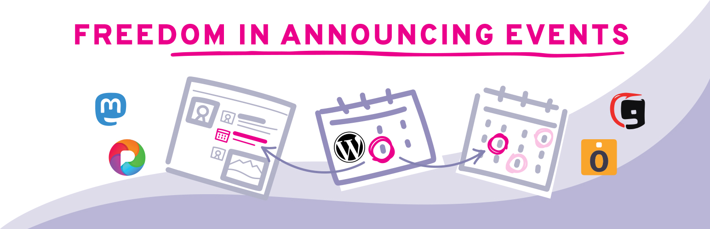
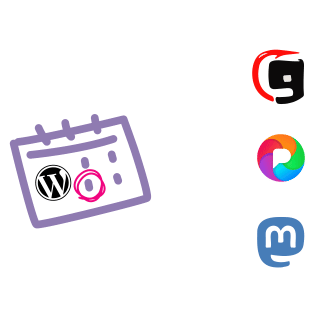
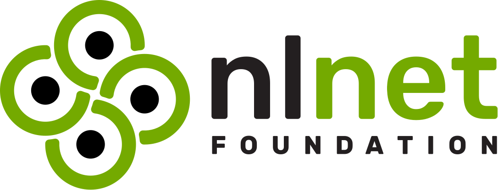
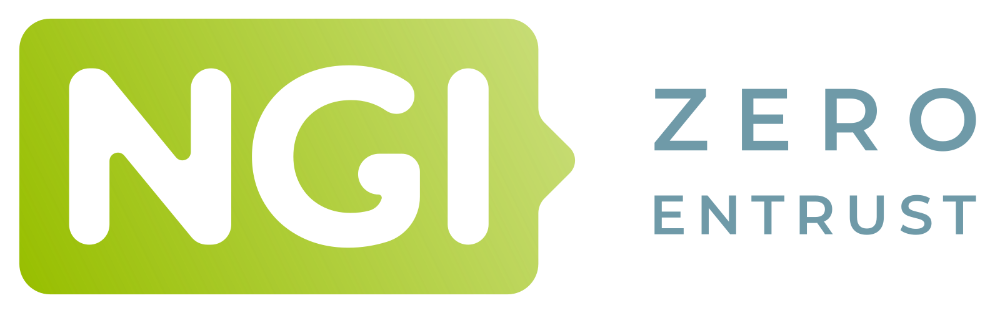

# Event Bridge for ActivityPub #
**Contributors:** [andremenrath](https://profiles.wordpress.org/andremenrath/)  
**Tags:** events, fediverse, activitypub, calendar  
**Requires at least:** 6.5  
**Tested up to:** 6.7  
**Stable tag:** 0.4.0  
**Requires PHP:** 7.4  
**License:** AGPL-3.0-or-later  
**License URI:** https://www.gnu.org/licenses/agpl-3.0.html  
Integrating popular event plugins with the ActivityPub plugin.

## Description ##

Make your events more discoverable, expand your reach effortlessly while being independent of other (commercial) platforms, and be a part of the growing decentralized web (the Fediverse).
With the Event Bridge for ActivityPub Plugin for WordPress, your events can be automatically followed, aggregated and displayed across decentralized platforms like [Mastodon](https://joinmastodon.org) or [Gancio](https://gancio.org), without any extra work.
Forget the hassle of managing multiple social media accounts just to keep your audience informed.

This plugin is not an event managing plugin but an add-on to popular event plugins. It extends their functionality to fully support the [ActivityPub plugin](https://wordpress.org/plugins/activitypub/).
With the ActivityPub plugin people can follow your website directly and engage with your events just as they would on social media: liking, boosting and even commenting if you enable it.
You retain full ownership of your content. By integrating into your existing setup, it ensures no extra work is needed while enhancing your events' visibility across the web.

### Supported Event Plugins ###

Full support (including importing events from the Fediverse):

* [The Events Calendar](https://de.wordpress.org/plugins/the-events-calendar/)
* [VS Event List](https://de.wordpress.org/plugins/very-simple-event-list/)
* [GatherPress](https://gatherpress.org/)

Basic support (outgoing events):

* [Events Manager](https://de.wordpress.org/plugins/events-manager/)
* [WP Event Manager](https://de.wordpress.org/plugins/wp-event-manager/)
* [Eventin](https://de.wordpress.org/plugins/wp-event-solution/)
* [Modern Events Calendar Lite](https://webnus.net/modern-events-calendar/)
* [Event Organiser](https://wordpress.org/plugins/event-organiser/)

### How It Works ###

With the Event Bridge for ActivityPub WordPress plugin, sharing your events is effortless and automatic!
Once you create an event on your WordPress site, it is seamlessly shared across the decentralized web using the ActivityPub protocol.

    

Your events can be automatically delivered to platforms that fully support events, such as [Mobilizon](https://joinmobilizon.org/), [Gancio](https://gancio.org), [Friendica](https://friendi.ca), [Hubzilla](https://hubzilla.org), and [Pleroma](https://pleroma.social/).
These platforms create public event calendars by pulling in events from various sources, including your website. Any updates you make to your events are synced across these platforms—so you only need to manage your events on your own site, with no extra work required.

    

Even platforms that don't yet fully support events, like [Mastodon](https://joinmastodon.org), will still receive a detailed, well-composed summary of your event.
The Event Federation plugin ensures that users from those platforms are provided with all important information about an event.

### Features for Your WordPress Events and the Fediverse ###

**ActivityPub-Enabled Event Sharing:** Your WordPress events are now compatible with the Fediverse, using the ActivityStreams format. This means your events can be easily discovered and followed by users on platforms like Mastodon and other ActivityPub-compatible services.

**Automatic Event Summaries:** When your event is shared on the Fediverse, platforms like Mastodon that don't fully support events will display a brief HTML summary of key details — such as the event's title, start time, and location. This ensures that even if someone can't view the full event on their platform, they still get the important info at a glance, with a link to your WordPress event page. Advanced users can create custom summaries via a set of shortcodes.

**Improved Event Discoverability:** Your custom event categories are mapped to a set of default categories used in the Fediverse, helping your events reach a wider audience. This improves the chances that users searching for similar events on other platforms will find yours.

**Event Reminders for Your Followers:** Often, events are planned well in advance. To keep your followers informed right in time, you can set up reminders that are supposed to trigger the events showing up in their timelines right before the event starts. At the moment this reminder is implemented as a self-boost of your original event post. While this feature may behave differently across various platforms, we are working on a more robust solution that will let you schedule dedicated reminder notes that appear in all followers' timelines.

**External Event Sources:**  This functionality is only available for a subset of the supported event plugins. It enables your WordPress site to act as a hub for displaying events from other ActivityPub profiles, aggregating them into a cohesive calendar view.

## Installation ##

This plugin depends on the [ActivityPub plugin](https://wordpress.org/plugins/activitypub/). Additionally, you need to use one of the supported event Plugins.

## Configuration ##

If you're new to the [ActivityPub plugin](https://wordpress.org/plugins/activitypub/), it’s recommended to spend a few minutes reading through its documentation to familiarize yourself with its setup and functionality.

## Frequently Asked Questions ##

### Do I need to install another event plugin to use the Event Federation Plugin? ###

Yes, this plugin works as an add-on and requires both the ActivityPub plugin and a supported event plugin such as The Events Calendar, VS Event List, or Events Manager to manage your events. It just fills the missing gap between event plugins and the [ActivityPub plugin](https://wordpress.org/plugins/activitypub/).

### What platforms can follow my events? ###

Your events can be followed on platforms that support ActivityPub like [Mobilizon](https://joinmobilizon.org/), [Gancio](https://gancio.org), [Friendica](https://friendi.ca), [Hubzilla](https://hubzilla.org), and [Pleroma](https://pleroma.social/). Even other applications like [Mastodon](https://joinmastodon.org), which don't fully support events yet, will display all important information about the events.

### How much extra work is required to maintain my events across the decentralized Web? ###

None! Once the plugin is set up, your events are automatically sent to all connected platforms or account that follow you (your Website). Any updates you make to your events are synced without additional effort.

### Can I still use social media to promote my events? ###

Yes, you can still use traditional social media if you wish. However, this plugin helps reduce reliance on commercial platforms by connecting your events to the decentralized Fediverse.

### Will this plugin work if I don't use the ActivityPub plugin? ###

No, the Event Federation Plugin depends on the [ActivityPub plugin](https://wordpress.org/plugins/activitypub/) to deliver your events across decentralized platforms, so it's essential to have it installed and configured.

### My event plugin is not supported, what can I do? ###

If you know about coding have a look at the documentation of how to add your plugin or open an [issue](https://codeberg.org/Event-Federation/wordpress-event-bridge-for-activitypub/issues), if we can spare some free hours we might add it.

### What if I experience problems? ###

We're always interested in your feedback. Feel free to reach out to us via [E-Mail](https://event-federation.eu/contact/) or create an [issue](https://codeberg.org/Event-Federation/wordpress-event-bridge-for-activitypub/issues).

## Acknowledgement

The development of this WordPress plugin was funded through the [NGI0 Entrust](https://NLnet.nl/entrust) Fund, a fund established by [NLnet](https://nlnet.nl) with financial support from the European Commission's [Next Generation Internet](https://ngi.eu) programme, under the aegis of [Communications Networks, Content and Technology](https://commission.europa.eu/about-european-commission/departments-and-executive-agencies/communications-networks-content-and-technology_en) under grant agreement number 101069594.
